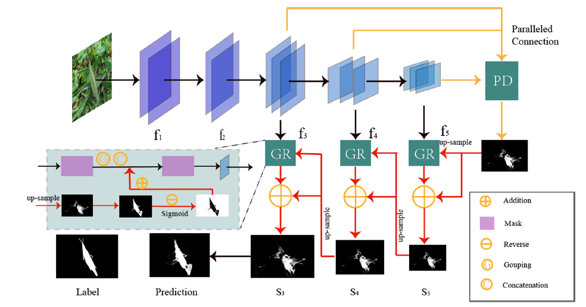
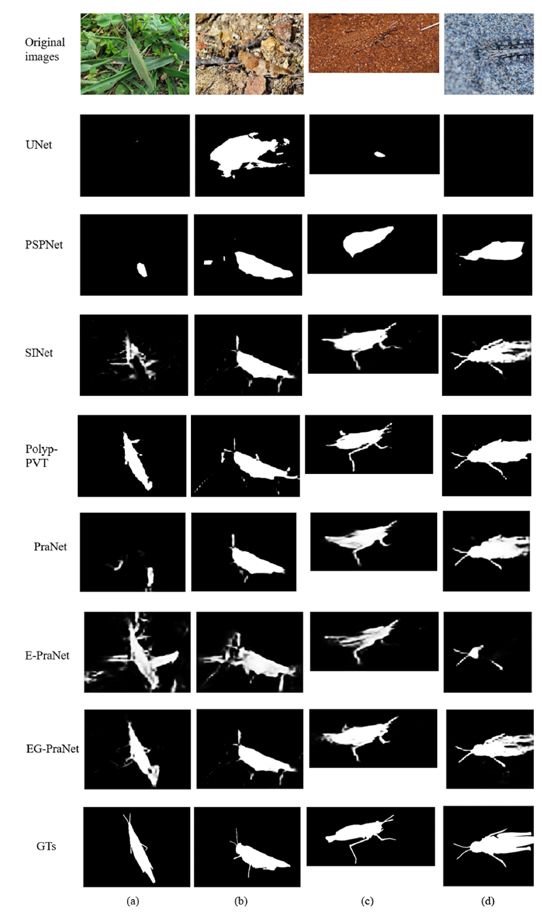

# EG-PraNet: Camouflaged Locust Segmentation

[](https://www.sciencedirect.com/science/article/abs/pii/S0168169922003787)
[](https://github.com/Chloe-Liu33/Locust-mini)
[](https://opensource.org/licenses/MIT)

> Official implementation of the paper: **"Camouflaged locust segmentation based on PraNet"** (Computers and Electronics in Agriculture, 2022).

## 📌 Overview

Precise detection and segmentation of camouflaged pests are critical for assisting plant protection robots in real-time agricultural management. This repository provides an end-to-end deep learning framework, **EG-PraNet**, designed to accurately segment locusts that camouflage themselves within complex natural backgrounds.

We optimized the feature extraction pipeline and enhanced data robustness, allowing EG-PraNet to achieve state-of-the-art efficiency and accuracy on our custom **Locust-mini** dataset

## 🧠 Model Architecture

Our framework introduces highly efficient structural improvements to balance computational cost and segmentation precision. The EG-PraNet architecture utilizes a ResNet50 backbone combined with one Parallel Partial Decoder (PPD) and three Group Reverse (GR) modules to fuse multi-level semantic information.


<p align="center">
  
</p>
<p align="center">
  <em>Fig 1: The overall architecture of EG-PraNet.</em>
</p>

## 📊 Visual Results & Performance

EG-PraNet exhibits superior segmentation capabilities, especially in distinguishing targets with weak boundaries and colors highly similar to their backgrounds[cite: 2]. 


<p align="center">
  
</p>
<p align="center">
  <em>Fig 2: Comparison of segmentation masks against other baselines.</em>
</p>

**Key Performance Metrics:**
* **Accuracy Leap:** Compared to the baseline PraNet, EG-PraNet increases the Dice coefficient by **0.126** and IoU by **0.152**.
* **High Throughput:** Optimized for real-time robotic deployment, achieving **16.4 fps** on a Tesla K80 GPU.

## 🚀 Getting Started

### 1. Prerequisites
Ensure your environment is set up. We recommend using a virtual environment:
```bash
git clone [https://github.com/Chloe-Liu33/PraNet-object-segmentation.git](https://github.com/Chloe-Liu33/PraNet-object-segmentation.git)
cd PraNet-object-segmentation
pip install -r requirements.txt
